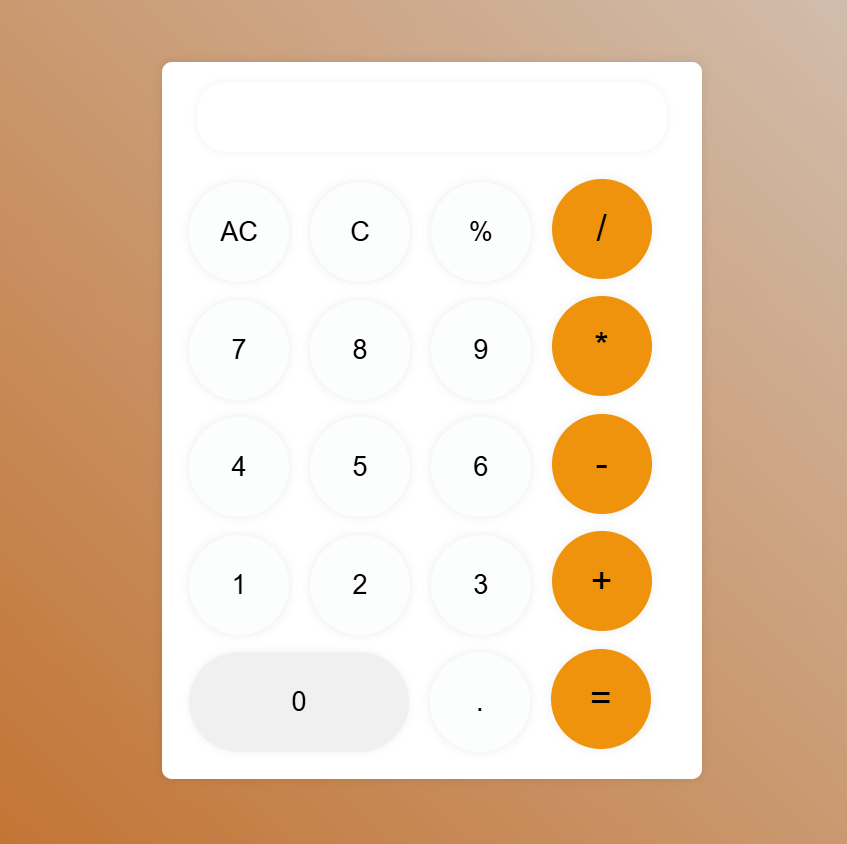

# 🧮 Calculatrice Web Moderne

Une calculatrice web élégante, minimaliste et responsive. Ce projet est conçu avec HTML, CSS et JavaScript pour offrir une expérience utilisateur fluide et intuitive, avec un design rond et moderne.



## ✨ Fonctionnalités

- Opérations de base : addition, soustraction, multiplication, division, pourcentage
- Réinitialisation complète (`AC`) ou partielle (`C`)
- Prise en charge du point décimal
- Affichage en temps réel des entrées et résultats
- Design responsive et épuré

## 🛠️ Technologies utilisées

- **HTML5** : structure de la page
- **CSS3** : design moderne, flexbox, styles ronds
- **JavaScript** : logique des calculs et interactions

## 📦 Installation

1. Clone le dépôt :
   ```bash
   git clone https://github.com/nicostar-lab/calculator.git

## 🤝 Contribution
Les contributions sont les bienvenues !
N'hésitez pas à forker le projet, proposer des améliorations ou signaler des bugs.

## 📄 Licence
Ce projet est open-source et disponible sous la licence MIT.

Auteur : [nicostar-lab](https://github.com/nicostar-lab)
